```mermaid
flowchart LR
  %% Styling
  classDef ingestion fill:#e3f2fd,stroke:#1976d2,color:#0d47a1
  classDef indexing fill:#e0f2f1,stroke:#00897b,color:#004d40
  classDef retrieval fill:#e8f5e9,stroke:#43a047,color:#1b5e20
  classDef generation fill:#fff3e0,stroke:#fb8c00,color:#e65100
  classDef evaluation fill:#f3e5f5,stroke:#8e24aa,color:#4a148c
  classDef ui fill:#fce4ec,stroke:#d81b60,color:#880e4f

  subgraph "SECTION 1 - DATA INGESTION"
    A["🔗 Fixed URLs (200)"]:::ingestion
    B["🎲 Random URLs (300)"]:::ingestion
    A --> D["⚙️ URL Loader"]:::ingestion
    B --> D
    D --> E["🕷️ Web Scraper"]:::ingestion
    E --> F["✂️ Cleaner + Chunker<br/>(200-400 tokens, 50 overlap)"]:::ingestion
    F --> G["📦 Corpus<br/>(chunks + metadata)"]:::ingestion
  end

  subgraph "SECTION 2 - INDEXING"
    G --> H["🧠 Dense Embeddings<br/>(SentenceTransformer)"]:::indexing
    G --> I["📝 Sparse Tokens<br/>(BM25)"]:::indexing
    H --> J["🗄️ FAISS Vector Index"]:::indexing
    I --> K["🗂️ BM25 Index"]:::indexing
  end

  subgraph "SECTION 3 - RETRIEVAL"
    L["❓ User Query"]:::retrieval
    L --> M["🔍 Dense Retrieval (Top-K)"]:::retrieval
    L --> N["🔎 Sparse Retrieval (Top-K)"]:::retrieval
    J -.-> M
    K -.-> N
    M --> O["⚖️ RRF Fusion (k=60)"]:::retrieval
    N --> O
    O --> P["📄 Top-N Context Chunks"]:::retrieval
  end

  subgraph "SECTION 4 - GENERATION"
    P --> Q["📋 Prompt Builder"]:::generation
    Q --> R["🤖 LLM<br/>(Flan-T5 / GPT2)"]:::generation
    R --> S["💬 Generated Answer"]:::generation
  end

  subgraph "SECTION 5 - EVALUATION"
    G --> T["❓ Q&A Generator<br/>(100 Qs)"]:::evaluation
    T --> U["🧪 Evaluation Runner"]:::evaluation
    U --> V["📊 Metrics<br/>MRR, ROUGE-L, BERTScore"]:::evaluation
    U --> W["🔬 Ablation +<br/>Error Analysis"]:::evaluation
    V --> X["📑 HTML Report"]:::evaluation
    W --> X
  end

  subgraph "SECTION 6 - UI"
    S --> Y["🖥️ Streamlit App"]:::ui
    P --> Y
    O --> Y
  end
```

## Architecture Overview

### Section 1: Data Ingestion (Blue)
- **Fixed URLs (200)**: Curated Wikipedia articles for consistent evaluation
- **Random URLs (300)**: Randomly sampled for diversity
- **URL Loader → Scraper → Chunker**: Full ETL pipeline
- **Output**: Corpus with 200-400 token chunks, 50-token overlap

### Section 2: Indexing (Teal)
- **Dense Embeddings**: SentenceTransformer (all-MiniLM-L6-v2) encodes chunks
- **Sparse Tokens**: BM25 tokenizes for keyword matching
- **Dual Index**: FAISS for vectors, BM25 for keywords

### Section 3: Retrieval (Green)
- **Parallel Retrieval**: Query hits both dense and sparse indices
- **RRF Fusion**: Combines rankings with k=60
- **Output**: Top-10 context chunks

### Section 4: Generation (Orange)
- **Prompt Builder**: Formats context + query
- **LLM**: Flan-T5-base generates answer
- **Output**: Natural language response

### Section 5: Evaluation (Purple)
- **Q&A Generator**: Creates 100 diverse questions
- **Metrics**: MRR (0.8587), ROUGE-L (0.2458), BERTScore (0.7019)
- **Analysis**: Ablation studies + error categorization
- **Output**: HTML report with charts

### Section 6: UI (Pink)
- **Streamlit App**: Displays query, answer, context, and scores

